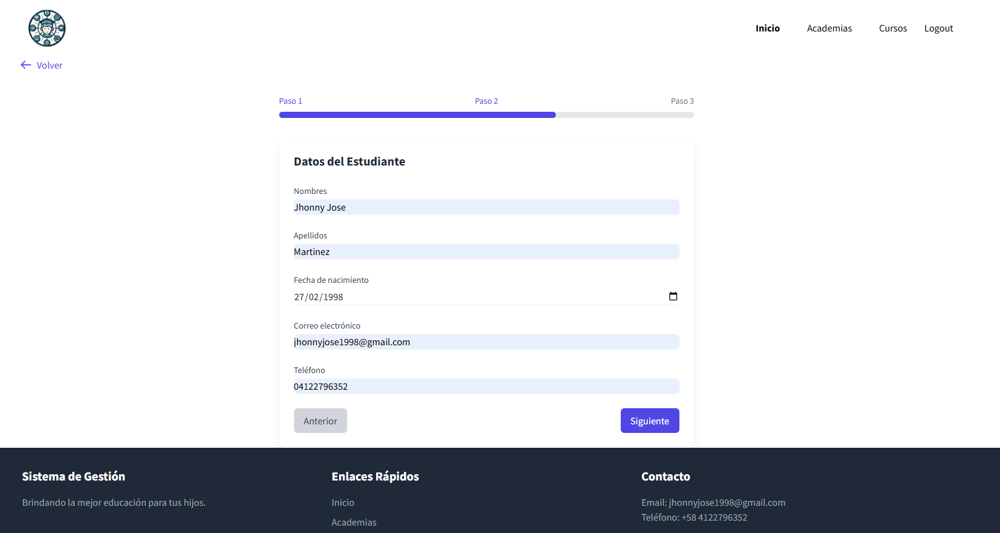
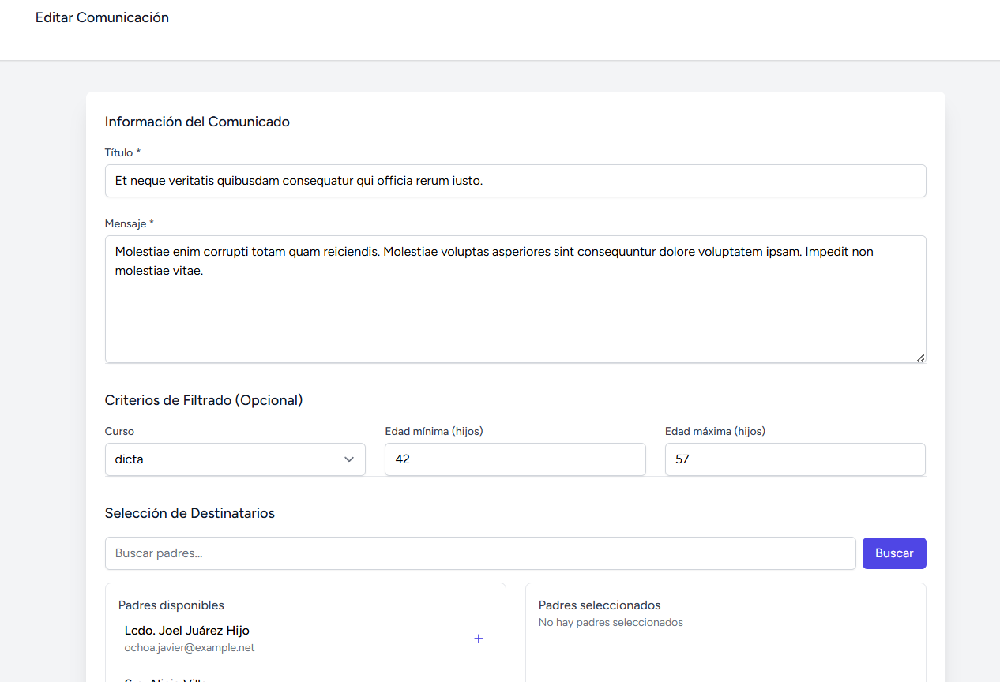
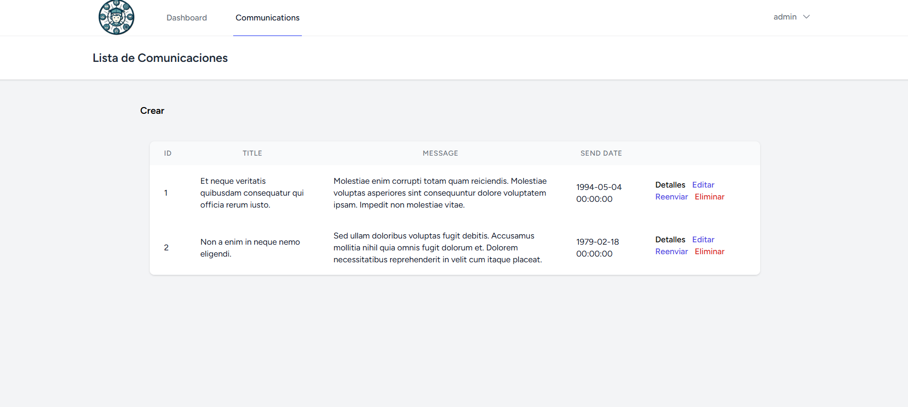

# Sistema de Gestión de Matrículas


## Descripción

Sistema completo para gestión de matrículas estudiantiles, comunicaciones y tareas administrativas para instituciones educativas. Cuenta con acceso por roles para administradores y padres de familia, además de soporte para API.

## Características principales

### Página de inicio



### Panel de administración



## Requisitos del sistema

- PHP 8.0 o superior
- Composer 2.0 o superior
- MySQL 5.7+ o MariaDB 10.3+
- Node.js 14.x+ (para assets frontend)
- Git

## Guía de instalación

### 1. Clonar el repositorio
```bash
git clone https://github.com/Yusuke1998/enrollment_management_system
cd enrollment_management_system
```
## Instalación y Configuración

### 1. Instalar dependencias PHP
```bash
composer install
```
### 2. Configurar archivo de entorno
```bash
cp .env.example .env
php artisan key:generate
```
### 3. Configurar base de datos

- Crear una base de datos MySQL
- Configurar las credenciales en el archivo .env:

```bash
DB_CONNECTION=mysql
DB_HOST=127.0.0.1
DB_PORT=3306
DB_DATABASE=nombre_basedatos
DB_USERNAME=usuario
DB_PASSWORD=contraseña
```

### 4. Migraciones y datos iniciales
```bash
php artisan migrate:fresh --seed
```
### 5. Configurar almacenamiento
```bash
php artisan storage:link
```
### 6. Instalar dependencias frontend (opcional)
```bash
npm install
npm run dev
```
### 7. Iniciar servidor de desarrollo
```bash
php artisan serve
```

## Credenciales de Acceso

| Rol           | Email            | Contraseña |
|---------------|------------------|------------|
| Administrador | admin@admin.com  | admin      |
| Padre         | father@father.com| father     |

**Privilegios:**
- **Administrador:** Acceso completo al sistema, incluyendo:
  - Gestión de comunicaciones
  - Administración de usuarios
  - Configuración del sistema
- **Padre:** Capacidades limitadas:
  - Matricular estudiantes
  - Recibir comunicaciones

## Uso de la API

### Autenticación
# Login
```bash
POST /api/login
# Body:
{
   "email":"user@example.com","password":"password"
}
# Response:
{
    "user": {
        "id": 3,
        "name": "user",
        "email": "user@user.com",
        "email_verified_at": "2025-04-11T17:52:20.000000Z",
        "two_factor_confirmed_at": null,
        "current_team_id": null,
        "profile_photo_path": null,
        "created_at": "2025-04-11T17:52:20.000000Z",
        "updated_at": "2025-04-11T17:52:20.000000Z",
        "profile_photo_url": "https://ui-avatars.com/api/?name=f&color=7F9CF5&background=EBF4FF"
    },
    "token": "3|XAYG7hdgIHy5E3hFlXFiBN11YUve520aJyTRANss458b24e6"
}
```

# Registro
```bash
POST /api/register 
# Body: 
{
   "name":"Nombre","email":"email@example.com","password":"contraseña"
}
# Response
{
    "user": {
        "name": "Nombre",
        "email": "email@example.com",
        "updated_at": "2025-04-11T18:33:27.000000Z",
        "created_at": "2025-04-11T18:33:27.000000Z",
        "id": 14,
        "profile_photo_url": "https://ui-avatars.com/api/?name=j+p&color=7F9CF5&background=EBF4FF"
    },
    "token": "5|9YerhpwJpj55497R1gccngu1ai1cYwAz2Fp00yqN6ce55ed7"
}
```

# Endpoints protegidos

```bash
# Crear academia
POST /api/academies
Headers: Authorization: Bearer {token}
# Body: 
{
   "name":"Nombre Academia","description":"Descripción"
}
# Response:
{
    "name": "Nombre Academia",
    "description": "Descripción",
    "updated_at": "2025-04-11T18:35:32.000000Z",
    "created_at": "2025-04-11T18:35:32.000000Z",
    "id": 11
}
```

# ...